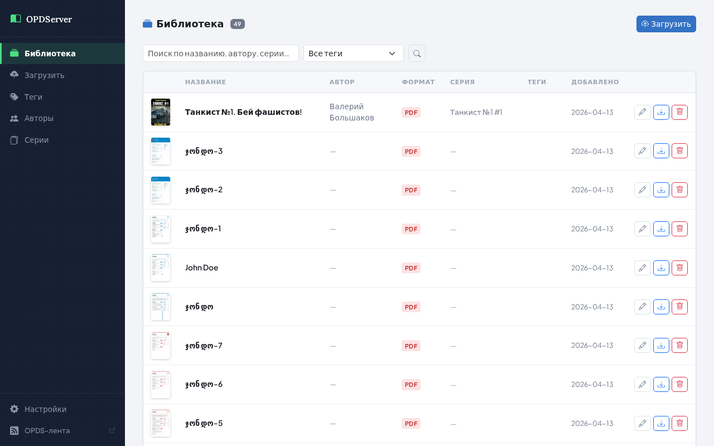

# OPD Server

An OPDS 1.2 catalog server for serving ebooks to KOReader on jailbroken Kindles. Includes a web management UI for uploading books, editing metadata, and organizing with tags, authors, and series.

## Features

- **OPDS 1.2 feeds** — compatible with KOReader, Kindle, and any OPDS-capable reader
- **Web UI** — upload, browse, search, and edit book metadata from a browser
- **Metadata search** — fetch metadata automatically from Google Books and Open Library
- **Cover extraction** — covers are extracted from EPUB files on upload
- **Tag / Author / Series organization** — browse and filter your library
- **Metadata write-back** — optionally save metadata changes back into EPUB, PDF, FB2, and CBZ files
- **Extensible metadata plugins** — drop a `.py` file in `metadata/` to add a new source

## Screenshot



## Quick Start

### With Docker (recommended)

```bash
# 1. Clone the repo
git clone https://github.com/D4VM/opdserver.git
cd opdserver

# 2. Pre-create the data directory and settings file
#    (Docker will create settings.json as a directory if it doesn't exist first)
mkdir -p data && touch data/settings.json

# 3. Set your LAN IP in docker-compose.yml (BASE_URL line), then:
docker compose up --build
```

Open `http://localhost:8000` in your browser. Your library data is stored in `./data/` and survives container restarts.

After code changes, rebuild with:
```bash
docker compose up --build
```

### Without Docker

```bash
pip install -r requirements.txt
python3 main.py
```

For KOReader, add an OPDS catalog pointing to `http://<server-ip>:8000/opds`.

## Configuration

All settings are optional environment variables:

| Variable | Default | Description |
|---|---|---|
| `BASE_URL` | `http://localhost:8000` | Public URL used in OPDS feed links — set to your LAN IP |
| `SERVER_TITLE` | `My Library` | Title shown in UI and OPDS feeds |
| `LOCALE_LANG` | `en` | Default UI language code (e.g. `ru`). Can be changed later in Settings. |
| `PORT` | `8000` | Port to listen on |
| `HOST` | `0.0.0.0` | Host to bind |

Example:

```bash
BASE_URL=http://192.168.1.100:8000 SERVER_TITLE="Home Library" python3 main.py
```

## Architecture

```
main.py          FastAPI app entry point, startup hooks, static file mounts
config.py        All paths and settings (BASE_DIR, BOOKS_DIR, COVERS_DIR, BASE_URL, …)
database.py      init_db(), get_db(), all SQL query functions (raw aiosqlite, no ORM)
models.py        Python dataclasses: Book, Tag, BookWithTags
routers/
  opds.py        OPDS 1.2 Atom XML feeds — all /opds/* endpoints
  api.py         JSON REST API: upload pipeline, book/tag CRUD, metadata search/apply
  web.py         Jinja2 HTML routes for the management UI
metadata/
  __init__.py    Auto-discovery loader — scans *.py, registers MetadataPlugin subclasses
  base.py        MetadataPlugin ABC + MetadataResult dataclass
  google_books.py  Google Books API plugin
  open_library.py  Open Library API plugin
templates/       Jinja2 HTML templates (Bootstrap 5, no build step)
static/          CSS + vanilla JS
books/           Uploaded ebook files, stored as {uuid}.{ext}
covers/          Extracted cover images as {uuid}.jpg
library.db       SQLite database (auto-created on startup)
```

## OPDS Feed Endpoints

| URL | Type | Description |
|---|---|---|
| `/opds` | Navigation | Root catalog |
| `/opds/all?page=N` | Acquisition | All books, paginated |
| `/opds/recent?page=N` | Acquisition | Books by date added |
| `/opds/tags` | Navigation | All tags |
| `/opds/tags/{name}?page=N` | Acquisition | Books by tag |
| `/opds/search?q=&page=N` | Acquisition | Full-text search |
| `/books/{uuid}.{ext}` | File | Download a book |
| `/covers/{uuid}.jpg` | Image | Book cover |

## Web UI Endpoints

| URL | Description |
|---|---|
| `/books` | Library — browse, search, filter |
| `/books/{id}/edit` | Edit book metadata, tags, cover |
| `/upload` | Upload new books |
| `/tags` | Manage tags |
| `/authors` | Browse by author |
| `/series` | Browse by series |
| `/settings` | UI settings — language switcher |

REST API docs are available at `/api/docs` (FastAPI auto-generated Swagger UI).

## Writing a Metadata Plugin

Drop a `.py` file in the `metadata/` directory. Define a class that inherits `MetadataPlugin` — it's auto-registered on first search.

```python
from metadata.base import MetadataPlugin, MetadataResult

class MyPlugin(MetadataPlugin):
    name = "My Source"

    async def search(self, title: str, author: str = "") -> list[MetadataResult]:
        # fetch from your API
        return [MetadataResult(
            source=self.name,
            title="...",
            author="...",
            description="...",
            cover_url="https://...",
        )]
```

## Localization

The UI ships with English and Russian. Switch languages from the **Settings** page (`/settings`) without restarting the server. The active language is saved to `settings.json` and persists across restarts.

### Default language

Set the `LOCALE_LANG` environment variable to load a language on startup:

```bash
LOCALE_LANG=ru python3 main.py
```

In `docker-compose.yml`:
```yaml
environment:
  - LOCALE_LANG=ru
```

### Adding a language

1. Copy `locales/en.json` to `locales/<code>.json` (e.g. `locales/de.json`)
2. Translate the values (not the keys)
3. Set `"locale_name"` to the language's native name (e.g. `"Deutsch"`)
4. Restart the server — the new language appears in Settings automatically

```json
{
  "locale_name": "Deutsch",
  "nav_library":  "Bibliothek",
  "nav_upload":   "Hochladen",
  "btn_save":     "Speichern",
  ...
}
```

If a key is missing from your translation file, the interface falls back to the English value.

## Running Tests

```bash
pip install -r requirements.txt
python3 -m pytest tests/ -v
```

The suite uses a temporary database and file directories — it never touches your library data.

## Supported Formats

EPUB, PDF, MOBI, AZW, AZW3, CBZ, FB2, TXT

Metadata and cover extraction is fully supported for EPUB. Other formats fall back to filename-based title parsing.
